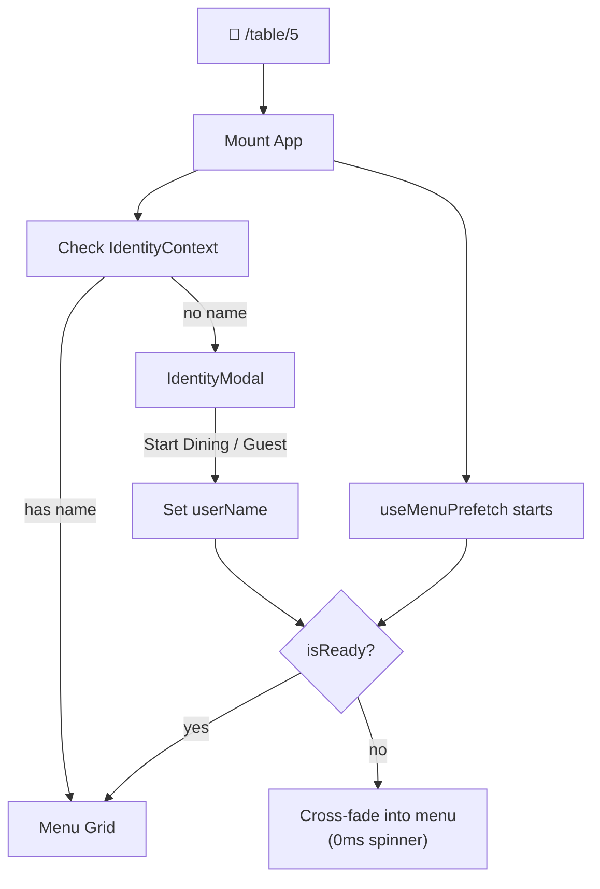

# Turbo-Onboarding Module — Implementation Plan

Status: Historical proposal.
Current architecture references: `docs/engineering/REPO_ARCHITECTURE.md`

## Architecture



**Key insight:** Menu prefetch runs in parallel with identity collection. By the time the user types their name (~2-3s), data is already cached.

## Proposed Changes

### Dependencies

#### Install TanStack Query
```bash
npm install @tanstack/react-query
```

---

### New Files

#### [NEW] `context/IdentityContext.tsx`

- Stores `userName`, `userId` (UUID), `isGuest`
- Random name generator: `["Hungry","Happy","Crispy","Golden","Chilled"]` × `["Taco","Noodle","Dumpling","Brioche","Espresso"]`
- Persists to `sessionStorage` (key: `connoisr-identity-{tableId}`)
- Exposes `setIdentity(name)` and `joinAsGuest()` actions
- Checks sessionStorage on mount → if found, auto-hydrates (returning guests skip modal)

#### [NEW] `hooks/useMenuPrefetch.ts`

- Uses `useQuery` with key `['menu', tableId]`
- `queryFn` returns the static `MENU_ITEMS` with a simulated async delay (~200ms)
- Returns `{ isReady: boolean }` — true when data is cached
- Runs immediately on mount, in parallel with the IdentityModal

#### [NEW] `components/onboarding/IdentityModal.tsx`

| Element | Spec |
|---|---|
| **Overlay** | `backdrop-blur-xl bg-white/60 dark:bg-black/60` full-screen |
| **Card** | Centered, `max-w-sm`, subtle shadow |
| **Title** | "Welcome to Table X" — serif font |
| **Input** | Large, auto-focused, rounded-2xl, coral focus ring |
| **"Start Dining"** | `bg-[#FF6B4A]` solid button |
| **"Join as Guest"** | Ghost button with `border-[#6366F1]` |
| **Progress bar** | Bottom of card — fills as `useMenuPrefetch` loads |
| **Animation** | `motion.div` fade-in + scale-up on mount, slide-up exit |

#### [NEW] `components/providers/QueryProvider.tsx`

- Wraps app in `QueryClientProvider` with stale-time of 5 min

---

### Modified Files

#### [MODIFY] `app/table/[id]/layout.tsx` or `app/table/[id]/page.tsx`

- Wrap in `QueryProvider` + `IdentityProvider`

#### [MODIFY] `app/table/[id]/DinerPageClient.tsx`

- Import `useIdentity` and `useMenuPrefetch`
- `AnimatePresence` gate: show `IdentityModal` when no `userName`, cross-fade to menu when both `userName` and `isReady` are truthy
- Existing menu grid stays untouched — it IS the `MenuGrid`

#### [MODIFY] `types/index.ts`

- Add `guestName?: string` to `TableSession`
- Add `orderedByName?: string` to `CartItem`

#### [MODIFY] `components/providers/TableSessionProvider.tsx`

- Add `SET_GUEST_NAME` action
- Propagate `guestName` to cart items as `orderedByName`

## Verification Plan

### Automated
```bash
npx tsc --noEmit  # Type-check
```

### Manual
1. Fresh incognito visit to `/table/5` → IdentityModal appears
2. Type name + click "Start Dining" → instant menu transition
3. Click "Join as Guest" → random name assigned → instant transition
4. Refresh page → straight to menu (sessionStorage persists)
5. Place order → `orderedByName` attached to cart items
